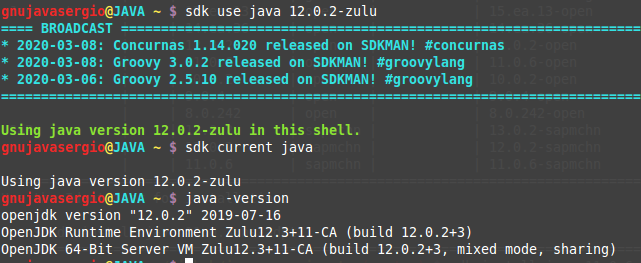

## Introducción
- Para saber mas la pagina web es [https://sdkman.io/](https://sdkman.io/)


## Que es SDKMAN?
- Como desarrolladores de Java, tenemos que trabajar con diferentes versiones de Java de un proyecto a otro. Instalar diferentes versiones a mano y configurar la RUTA puede convertirse en un verdadero dolor a veces.
- - Con SDKMAN, podremos administrar versiones paralelas de múltiples SDK fácilmente en cualquier sistema operativo de tipo Unix.
- Proporciona una conveniente interfaz de linea de comandos (CLI).
- La herramienta nos va a proporcionar una forma fácil de instalar, cambiar, enumerar y eliminar SDK.  
- Además permite a los desarrolladores instalar Kits de desarrollo de software para JVM, Groovy, Scala, Kotlin y Ceylon. Ant, Gradle, Grails, Maven, SBT, Spark, Spring Boot, Vert.x y muchos otros. 
- SDKMAN es gratuito, liviano, de código abierto y está escrito en Bash.
- SDKMAN también se encarga de establecer variables de entorno para usted.

## Instalar SDKMAN
- Instalar SDKMAN es muy sencillo.
- Para no tener problemas al instalar SDKMAN debemos asegurarnos aplicaciones zip, unzip y curl.
- SDKMAN puede instalarse en sistemas basados ​​en Linux y Mac. 

```bash
sudo apt install zip unzip curl
curl -s "https://get.sdkman.io" | bash
$ source "$HOME/.sdkman/bin/sdkman-init.sh"
# Probar que esta instalado correctamente
sdk version
```


## Administrar
- Para ver la lista de candidatos disponibles(SDK)
```
sdk list
```
- SDKMAN enumera los candidatos junto a una descripcion, sitio web oficial y el comando de instalación.
- **j** tecla para bajar la lista
- **k** tecla para subir la lista


## Instalar SDK
- Al instalar un sdk siempre instalara la ultima version estable.
```
sdk install kotlin
```


## Manejo de versiones
- Para enumerar las versiones disponibles de un candidato se utiliza el siguiente comando.
```bash
# Primero listamos las versiones
sdk list java
```


- Si se tiene varias versiones SDKMAN te preguntara si deseas que la versión que instalas se configure como predeterminada.
```bash
# Comando para instalar la version de un sdk
sdk install java 11.0.6-zulu
# Comando para hacer esta version como predeterminada
sdk default java 11.0.6-zulu
```


### SDK de java
- Para el JDK de java ahora hay multiples proveedores.
- Para instalar el proveedor se tiene que especificar la version y el proveedor <java.version>-<vndr>
- El mas recomendable es usar el proveedor **AdoptOpenJDK** ya que tiene el mejor soporte de la comunidad
- **GraalVM** es una opción entrante con la promesa de hacer java extremadamente rapido **tiene su propio sistema de versiones no relacionado con java**
- **AdoptOpenJDK** tiene compilaciones con dos maquinas virtuales. **HotSpot (classic)** y **j9 (modern faster)**
    - Es posible que se desee tener ambos instalado en caso de tener problema con alguno de ellos.
```bash
sdk install java 8.0.222.hs-adpt
sdk install java 8.0.222.j9-adpt
```
## Versiones Usadas
- Comando para verificar que versión de un SDK esta actualmente esta en uso de un candidato
```bash
sdk current java
```


- Comprobar las version actuales de los paquetes instalados con SDKMAN
```bash
sdk current
```


## Cambiar entre versiones
- Cambie la versión de Java temporalmente solo para este shell o terminal actual:
- **Nota** solo puedes cambiar de version si la version que quieres utilizar esta instalada en tu maquina.
```bash
sdk use java 11.0.4-sapmchn
sdk current java
java -version
```


- Cambiar la version de java de forma global para la terminal actual y las futuras terminales
```bash
sdk install java 13.0.2-zulu
```

## Actualizar candidato
- Para actualizar un sdk obsoleto
```bash
sdk upgrade java
```

- Para verificar si alguno de los SDK instalados esta desactualizado
```bash
sdk upgrade
```
## Donde esta instalado los SDK
- Revisar el directorio `~/.sdkman/candidates`.


- Se puede configurar o añadir los sdk a cualquier IDE


## Activar o desactivar funcion sin conexión
- SDKMAN tiene un modo fuera de linea que permite que SDKMAN funcione cuando se trabaje sin conexión.
```bash
sdk offline enable
sdk offline disable
```

## Eliminar un SDK
- Para eliminar un SDK instaldo con una version especifica
```
sdk uninstall kotlin 1.3.70
```

## Actualizar SDKMAN
- Si se quisiera actualizar SDKMAN a una nueva versión. El siguiente comando lo instala si es que esta disponible.
```bash
sdk selfupdate
```

## Limpiar
- Es recomandable limpiar el cache que contiene los archivos binarios SDK descargados de vez en cuando.
```bash
sdk flush archives
```

- Es recomandable tambien limpiar la carpeta temporal para ahorar espacio.
```
sdk flush temp
```


## Desintalar SDKMAN
- Si quisieras desintalar SDKMAN porque no te gusto no creo que pase, puedes desintalarlo con el siguiente comando.
```bash
rm -rf /home/gnujavasergio/.sdkman/
```
- Para finalizar editar los archivos .bashrc, bash_profile y/o .profile. Encuentra y elimina las siguientes lineas.


## Ayuda
- Para obtener ayuda y tener un detalle de los comandos que se pueden utilizar con SDKMAN se utiliza el siguiente comando.
```bash
sdk help
```

